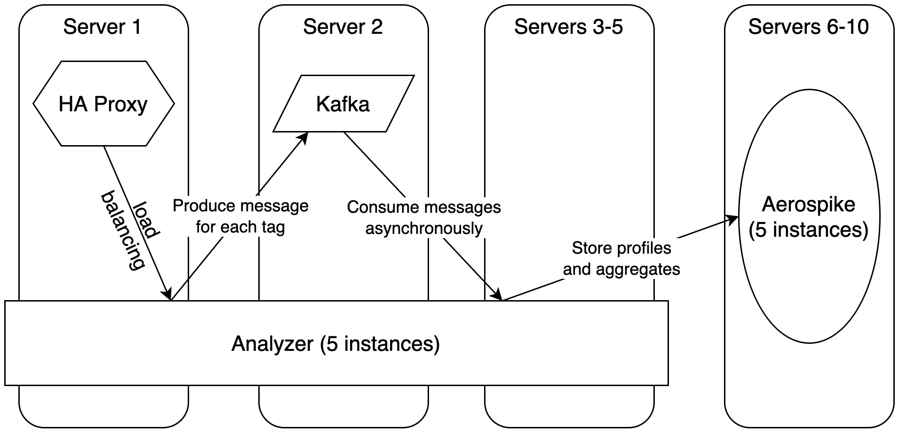

# Project for classes [Practical distributed systems](https://usosweb.uw.edu.pl/kontroler.php?_action=katalog2%2Fprzedmioty%2FpokazPrzedmiot&kod=1000-2M21PRS&lang=en)

## Author: Adam Wiktor

## Architecture:

System consists of 4 types of services:

* `HA Proxy`:
  * balances incoming load across all `Analyzer` replicas
* `Kafka`:
  * dispatches information about new tags for aggregation
* `Aerospike`:
  * stores user profiles and precomputed aggregates
* `Analyzer`:
  * processes new tags:
    * produces new message about tag to `Kafka`
    * retrieves current user profile from `Aerospike` and updates it with new tag (possibly removing old ones)
  * serves user profiles stored in Aerospike
  * serves aggregates based on precomputed data in `Aerospike`
  * precomputes aggregates:
    * consumes messages about tags from `Kafka`
    * stores aggregated data every 30 seconds in `Aerospike`
    * **IMPORTANT** this actually could be whole separate service, but it was easier to add this feature to already existing service instead of duplicating configuration code
